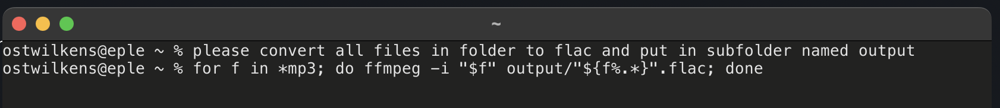

# please-zsh

Instead of spending precious seconds googling, let GPT tell you the command! 
It even types it into the input buffer for you. If you don't trust the recommendation, press Ctrl+C. 



# Requirements
- zsh shell
- OpenAI API account (https://openai.com/api/)

# Installation

Add the following to your ~/.zshrc file, replacing <API_KEY> with your OpenAI api key:

```bash
# please command
please(){
    api_key="<API_KEY>"

    # combine all user_prompt into one string
    user_prompt=""
    for arg in "$@"; do
        user_prompt="$user_prompt $arg"
    done

    # remove leading space
    user_prompt=${user_prompt:1}

    # build request body
    full_prompt="This is the bash command used to $user_prompt: "
    body='{"model": "text-davinci-002", "prompt": "'$full_prompt'", "temperature": 0.7, "max_tokens": 128}'

    # fetch and format response
    result=$(curl https://api.openai.com/v1/completions -s -H "Content-Type: application/json" -H "Authorization: Bearer $api_key" -d "$body" | jq --raw-output '.choices[0].text' | tr '\n' ' ')

    # remove leading whitespace characters
    result="${result#"${result%%[![:space:]]*}"}"

    # remove trailing whitespace characters
    result="${result%"${result##*[![:space:]]}"}"

    # send to input buffer
    print -z $result
}
```
